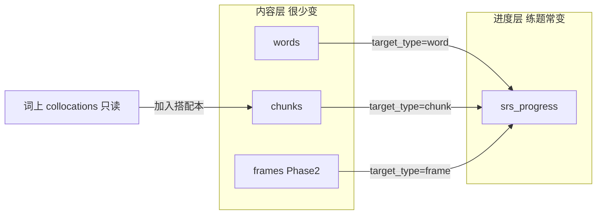
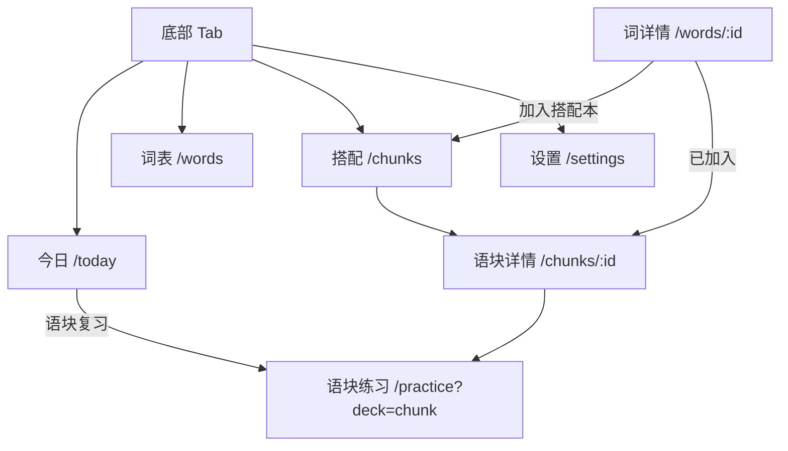

# 语块（搭配本）模块设计

> 对齐现有工程：Dexie `words` 表、`Word.collocations` / `dictCollocations` 作参考、`scheduler.ts` 艾宾浩斯、`Today` + `/practice` 单词练习。  
> 写作/口语 **模板（Frame）** 列为 Phase 2，第一版不实现。  
> **SRS 统一进度表**：Word / Chunk / Frame 共用一张 `srs_progress`，内容表不再存复习字段。

---

## 1. 产品边界

| 阶段 | 做什么 | 不做什么 |
|------|--------|----------|
| **MVP** | 独立「搭配本」+ 语块练习 + **统一 SRS 进度表**（含 Word 进度迁移） | 模板包、LLM 生成语块句 |
| **Phase 2** | 写作/口语 Frame 包、框架挖空 | 模板里每个生词自动进词表 |
| **长期** | 与 mixed 练习合并统计 | 词详情里所有搭配默认进 SRS |

### 核心原则

- `Word.collocations` / `dictCollocations` → **查阅 + 推荐**，不进复习队列。
- 只有用户 **「加入搭配本」** 的条目 → **Chunk 内容行 + 对应 srs_progress**。
- `go` / `take` 等功能词 **不单独建 Word**；只出现在 `phrase` 里。
- **内容与进度分轨**：练题只改 / 只同步 `srs_progress`，不碰 `words` / `chunks` 大行。

### 语块 SRS 含义

**SRS** = Spaced Repetition（间隔重复），与单词相同的艾宾浩斯阶梯（5 分钟 → … → 30 天）。  
**语块 SRS** = 复习单位是整段 phrase；调度字段存在 **统一进度表**，通过 `(target_type='chunk', target_id)` 关联。

---

## 2. 概念模型



- **Chunk（语块）**：内容表一行；≠ Word 里的 `Collocation` 数组项。
- **Frame（模板，Phase 2）**：内容另表；进度仍进 **同一张** `srs_progress`。
- **Word**：词义 / 例句等留在 `words`；`ease` / `nextReview` 等迁到 `srs_progress`。

### 2.1 Chunk 与 Frame：内容分表（已定）

**结论：`chunks` + `frames` 两张内容表**，不合并为 `deck_items`。  
**进度：一律进 `srs_progress`**，不在内容表重复存 SRS 列。

| 点 | 说明 |
|----|------|
| MVP | 内容只做 **chunks**；`srs_progress` 同时承接 **word + chunk** |
| Phase 2 | 增 **frames** 内容表；进度仍写 `target_type='frame'` |
| 共用 | `scheduler.ts`、`applyReview`、进度 sync API |
| UI | 一个「搭配」Tab；语块 \| 模板 = Segmented |
| 去重 | `(user_id, phrase_key)` / `(user_id, frame_key)` 各自唯一 |

---

## 3. 存储结构

### 3.1 统一进度类型

建议新文件：`apps/web/src/types/srsProgress.ts`

```ts
export type SrsTargetType = 'word' | 'chunk' | 'frame';

/** 与现有 Word SRS 字段对齐，便于 applyReview */
export interface SrsProgress {
  /** 合成键便于本地：`${targetType}:${targetId}` */
  id: string;
  targetType: SrsTargetType;
  targetId: string;          // word_id / chunk_id / frame_id
  ease: number;
  interval: number;          // 天
  streak: number;
  nextReview: number;
  totalReviews: number;
  correctReviews: number;
  /** 学习态：跟进度一起同步，不进内容表 */
  starred?: boolean;
  crossedOut?: boolean;
  updatedAt: number;
}
```

`scheduler.ts` 抽 `Reviewable`（或直接吃 `SrsProgress`），`applyReview` 只返回进度补丁。

### 3.2 TypeScript — Chunk 内容（MVP，无 SRS 字段）

`apps/web/src/types/chunk.ts`

```ts
export type ChunkSource = 'dict' | 'manual' | 'bank' | 'practice';
export type ChunkKind = 'collocation' | 'discourse';

export interface Chunk {
  id: string;
  phrase: string;
  phraseKey: string;
  gloss: string;
  kind?: ChunkKind;
  tags?: string[];
  anchorWordId?: string;
  source: ChunkSource;
  exampleEn?: string;
  exampleZh?: string;
  createdAt: number;
  updatedAt?: number;        // 仅内容变更
}

/** UI / 练习用：内容 ⊕ 进度（读时 join） */
export type ChunkWithProgress = Chunk & { progress: SrsProgress };
```

**去重**：同一用户 `phraseKey` 唯一。  
**phraseKey**：`trim` → 小写 → 空白归一。

加入搭配本时：写 `chunks` 一行 + upsert `srs_progress`（`target_type=chunk`，默认未学 / `nextReview=now`）。

### 3.3 Word 内容 vs 进度（迁移）

| 仍在 `words` / Word 内容 | 迁到 `srs_progress`（`target_type=word`） |
|--------------------------|------------------------------------------|
| word, translation, phonetic*, pos, mnemonic | ease, interval, streak, nextReview |
| category, synonyms, similars, derivatives | totalReviews, correctReviews |
| collocations, dictCollocations, examples | starred, crossedOut |
| createdAt, updatedAt（**仅内容**） | updatedAt（**仅进度**） |

前端可继续暴露「拼好的 Word」（读时 merge），但 **sync 必须分轨**：

- 改例句 / 助记 → 只 PATCH `/api/words/:id`，bump `words.updated_at`
- 练完 / 星标 / 划掉 → 只 PATCH `/api/srs/:type/:id`，bump `srs_progress.updated_at`

### 3.4 Dexie

**version 2（MVP）**：

```ts
// 内容
chunks: 'id, userId, phraseKey, anchorWordId, updatedAt',
// 统一进度（word + chunk；frame 预留同表）
srsProgress: 'id, userId, [userId+targetType], targetId, nextReview, updatedAt',
// id = `${targetType}:${targetId}`
```

- 词表行：逐步去掉内存里对「进度即 Word 字段」的假设；过渡期可双写，稳定后 `words` 表不再索引 `nextReview`。
- 到期队列：查 `srsProgress` where `targetType=chunk` and `nextReview <= now`，再 join `chunks`。
- 词到期：同理 `targetType=word`。

**version 3（Phase 2）**：

```ts
frames: 'id, userId, frameKey, updatedAt',
```

进度仍写 `srsProgress`，无需新进度表。

### 3.5 调度

复用 `apps/web/src/utils/scheduler.ts`：

- 入参改为 `SrsProgress`（或 `Reviewable`）
- `isDue` / `isNew` / `ladderProgressLabel` / `getWordStage` 基于 progress；展示时再拼 headline（词形 / phrase / title）

### 3.6 后端 PostgreSQL — 统一 `srs_progress`

```sql
CREATE TABLE IF NOT EXISTS srs_progress (
  user_id INTEGER NOT NULL REFERENCES users(id) ON DELETE CASCADE,
  target_type TEXT NOT NULL
    CHECK (target_type IN ('word', 'chunk', 'frame')),
  target_id TEXT NOT NULL,
  ease DOUBLE PRECISION NOT NULL DEFAULT 2.5,
  interval_days DOUBLE PRECISION NOT NULL DEFAULT 0,
  streak INTEGER NOT NULL DEFAULT 0,
  next_review TIMESTAMPTZ NOT NULL DEFAULT NOW(),
  total_reviews INTEGER NOT NULL DEFAULT 0,
  correct_reviews INTEGER NOT NULL DEFAULT 0,
  starred BOOLEAN NOT NULL DEFAULT FALSE,
  crossed_out BOOLEAN NOT NULL DEFAULT FALSE,
  updated_at TIMESTAMPTZ NOT NULL DEFAULT NOW(),
  PRIMARY KEY (user_id, target_type, target_id)
);

CREATE INDEX IF NOT EXISTS srs_progress_user_updated_idx
  ON srs_progress (user_id, updated_at);
CREATE INDEX IF NOT EXISTS srs_progress_user_type_next_review_idx
  ON srs_progress (user_id, target_type, next_review);
```

**从 `words` 迁移（一次性）**：

```sql
INSERT INTO srs_progress (
  user_id, target_type, target_id,
  ease, interval_days, streak, next_review,
  total_reviews, correct_reviews, starred, crossed_out, updated_at
)
SELECT
  user_id, 'word', word_id,
  ease, interval_days, streak, next_review,
  total_reviews, correct_reviews, starred, crossed_out, updated_at
FROM words
ON CONFLICT DO NOTHING;

-- 迁移验证通过后，再 DROP words 上的 SRS / starred / crossed_out 列
-- （或先保留只读兼容一版，API 写路径只写 srs_progress）
```

**说明**：进度行 **不设 FK 到 words/chunks**（类型多态）；删内容时应用层 `DELETE FROM srs_progress WHERE …`，或用触发器。孤儿进度可在 sync / 定时清理。

### 3.7 后端 — `chunks` 内容表（无 SRS 列）

```sql
CREATE TABLE IF NOT EXISTS chunks (
  user_id INTEGER NOT NULL REFERENCES users(id) ON DELETE CASCADE,
  chunk_id TEXT NOT NULL,
  phrase TEXT NOT NULL,
  phrase_key TEXT NOT NULL,
  gloss TEXT NOT NULL DEFAULT '',
  kind TEXT NOT NULL DEFAULT 'collocation',
  tags JSONB NOT NULL DEFAULT '[]'::jsonb,
  anchor_word_id TEXT,
  source TEXT NOT NULL DEFAULT 'manual',
  example_en TEXT NOT NULL DEFAULT '',
  example_zh TEXT NOT NULL DEFAULT '',
  created_at TIMESTAMPTZ NOT NULL DEFAULT NOW(),
  updated_at TIMESTAMPTZ NOT NULL DEFAULT NOW(),
  PRIMARY KEY (user_id, chunk_id)
);

CREATE UNIQUE INDEX IF NOT EXISTS chunks_user_phrase_key_idx
  ON chunks (user_id, phrase_key);
CREATE INDEX IF NOT EXISTS chunks_user_updated_idx
  ON chunks (user_id, updated_at);
```

新建 chunk 时事务内：`INSERT chunks` + `INSERT srs_progress (…, 'chunk', chunk_id, …)`。

### 3.8 REST API

#### 进度（Word / Chunk / Frame 共用）

| 方法 | 路径 | 用途 |
|------|------|------|
| GET | `/api/srs?since=&targetType=&limit=` | 增量拉进度（小包，无 examples） |
| PUT | `/api/srs/:targetType/:targetId` | upsert 整行进度 |
| PATCH | `/api/srs/:targetType/:targetId` | 字段级（练完主路径） |
| POST | `/api/srs/batch` | 换机 / 迁移批量 |
| DELETE | 随内容删除级联调用 | 删 word/chunk/frame 时删进度 |

练题结束 → **只打进度 API**，不再走 `/api/words/:id/progress`（旧接口可代理到 `/api/srs/word/:id` 一段时间）。

#### 内容 — chunks

| 方法 | 路径 | 用途 |
|------|------|------|
| GET | `/api/chunks?since=&limit=` | 增量拉内容（无 SRS） |
| PUT / PATCH / DELETE / batch | `/api/chunks…` | 内容 CRUD |

#### 内容 — words（行为变更）

| 变更 | 说明 |
|------|------|
| `GET /api/words?since=` | 仅内容变更进增量；练题 **不再** 刷 `words.updated_at` |
| `PATCH /api/words/:id` | 不再接受 ease/streak/nextReview… |
| 旧 `/progress` | 兼容转发到 `/api/srs/word/:id` |

前端：`srsApi.ts` + `chunksApi.ts`；`realtimeSync` 拆成 **content 队列** 与 **srs 队列**（words 内容 / chunks 内容 / 统一 srs）。

### 3.9 同步策略

1. **双 since 游标**（localStorage）：`wordsContentSince`、`chunksContentSince`、`srsSince`。  
2. 定时 / 回前台：`pull words?since` + `pull chunks?since` + `pull srs?since`（可并行）。  
3. 练完：只 enqueue srs patch（payload 几十字节级）。  
4. 不上传 dict 全量搭配、LLM 临时句；`synonymDiff` 辨析本体随词表 sync，本句 replace 不上云。

### 3.10 Frame — 内容表（Phase 2）

`apps/web/src/types/frame.ts`：`title`、`frameKey`、`skeleton`、`slots`、`glossZh`、`exampleFilled`、`packId`… **无 review 字段**。

后端 `frames` 表：内容列 + `updated_at`；加入模板时写 `srs_progress (frame, id)`。

API：`/api/frames/*`（内容）+ 进度仍走 `/api/srs/frame/:id`。

UI：搭配 Tab Segmented；`/frames/:id`；`/practice?deck=frame`。

---

## 4. 状态层

| Store | 职责 |
|-------|------|
| `useSrsProgress` | 加载 / upsert 进度；`dueCount(type)`；`applyReview` 写回 |
| `useChunks` | chunk 内容 CRUD；读列表时 join progress |
| `useWords` | 词内容；展示用 Word = content ⊕ progress（兼容现有 UI） |
| `useFrames` | Phase 2，同 chunks |

词表 store **不**单独再维护一套 ease/streak；进度以 `useSrsProgress` 为准。

---

## 5. 路由与信息架构

**增加底部 Tab**：今日 / 词表 / **搭配** / 设置。

### 5.1 底部导航（`MainLayout`）

| 顺序 | path | 标签 | 图标建议 |
|------|------|------|----------|
| 1 | `/today` | 今日 | `HomeOutlined` |
| 2 | `/words` | 词表 | `BookOutlined` |
| 3 | `/chunks` | 搭配 | `BlockOutlined` 或 `LinkOutlined` |
| 4 | `/settings` | 设置 | `SettingOutlined` |

- 高亮：`/chunks` 与 `/chunks/:id`（详情页底栏隐藏，高亮规则可与词详情一致）。
- 隐藏底栏：`/practice`、`/words/:id`、`/chunks/:id`（及 Phase 2 `/frames/:id`）。
- `/chunks` 列表页 **无返回**，与词表同级。



| 路由 | 页面 | 备注 |
|------|------|------|
| `/chunks` | `ChunksPage` | Tab 根页 |
| `/chunks/:id` | `ChunkDetailPage` | 隐藏底栏 |
| `/practice?deck=chunk&scope=…` | 扩展 `PracticePage` | 写进度进 srs |
| `/frames` … | Phase 2 | 同 Tab Segmented |

---

## 6. 页面设计

### 6.1 今日（`TodayPage`）

单词练习下方增加「语块复习」卡片：

| 元素 | 内容 |
|------|------|
| 统计 | 到期 N · 本库 M · 未练过 K（查 `srs_progress` where chunk） |
| 主按钮 | `/practice?deck=chunk&scope=review` |
| 次链接 | 搭配 Tab `/chunks` |

### 6.2 搭配本列表（`ChunksPage`）

顶栏「搭配」无返回；顶区到期统计 +「开始复习」；筛选 / 排序按 **join 后的 progress**；手动添加语块。

### 6.3 语块详情

phrase、gloss、锚词、例句、SRS 展示（来自 progress）、星标/划掉/删除（进度或内容+级联删进度）。

### 6.4 词详情

搭配旁「加入搭配本」/「已在搭配本 · 查看」。

### 6.5 语块练习

MVP 主题型一种（推荐例句挖空整段 phrase）。结束只 `applyReview` → 写 Dexie `srsProgress` → enqueue `/api/srs/chunk/:id`。

### 6.6 Phase 2 模板页

`/frames`、框架挖空；进度同样走 `srs_progress`。

---

## 7. MVP 实施顺序

1. ~~后端 `srs_progress` + `/api/srs` + words 迁移~~  
2. ~~前端 words sync 分轨~~  
3. ~~Chunk / Frame 内容表 + Dexie + store + sync~~  
4. ~~底栏 Tab「搭配」+ `/chunks` + Segmented 语块|模板~~  
5. ~~词详情「加入搭配本」+ 今日卡片 + 轻量练习（`/practice?deck=`）~~  
6. ~~Phase 2：预制模板包 + `/frames/:id` + `/api/frames`~~  
7. （可选）语块练习云端续做；Word 本地也拆到 Dexie `srsProgress`  
8. （可选）DROP `words` 上遗留 SRS 列

**风险点**：Word UI 大量读 `w.nextReview` —— 需一层 `getWordProgress(w)` 或 merge 视图，避免漏改；迁移要可回滚（先双写再删列）。

---

## 8. 待产品确认

| # | 问题 | 结论 / 建议默认 |
|---|------|----------------|
| 1 | 是否增加底栏 Tab？ | **是**：「搭配」→ `/chunks` |
| 2 | Tab 文案 | 建议 **搭配** |
| 3 | MVP 主题型 | 例句挖空 |
| 4 | 纯手输语块？ | 是 |
| 5 | Chunk / Frame 内容是否分表？ | **是** |
| 6 | SRS 是否统一一张进度表？ | **是**：`srs_progress`，word/chunk/frame 共用 |
| 7 | starred / crossedOut 放哪？ | **进度表**（跟学习态同步） |

---

## 9. 与现有文件对照

| 区域 | 现有 | 目标 |
|------|------|------|
| Word SRS | 嵌在 `words` 行 + 整行增量 | `srs_progress` + `/api/srs` |
| 搭配参考 | `Word.collocations` | 仍只读 |
| 语块内容 | （无） | `chunks` 表 + `/api/chunks` |
| 模板内容 | （无） | Phase 2 `frames` |
| 调度 | `scheduler.ts` 吃 Word | 吃 `SrsProgress` / Reviewable |
| 本地库 | Dexie `words` | + `chunks` + `srsProgress`（+ 后 `frames`） |
| 同步 | `realtimeSync` 混 content/progress | 内容队列 + **统一 srs 队列** |
| 练习 | `usePracticeSession` | `deck=chunk`；写 srs |
| 主导航 | 3 Tab | 4 Tab：+「搭配」 |

---

*文档版本：底栏 Tab + Chunk/Frame 内容分表 + 统一 srs_progress；实现以代码为准。*
